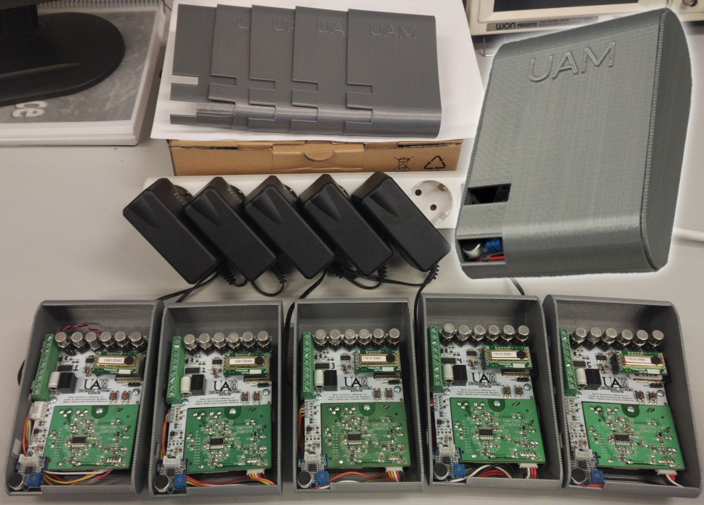
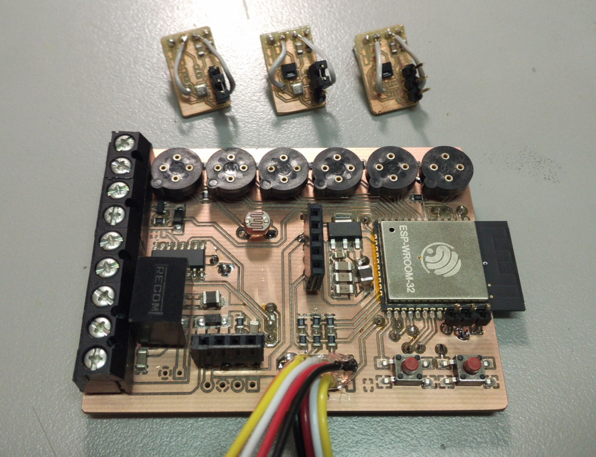
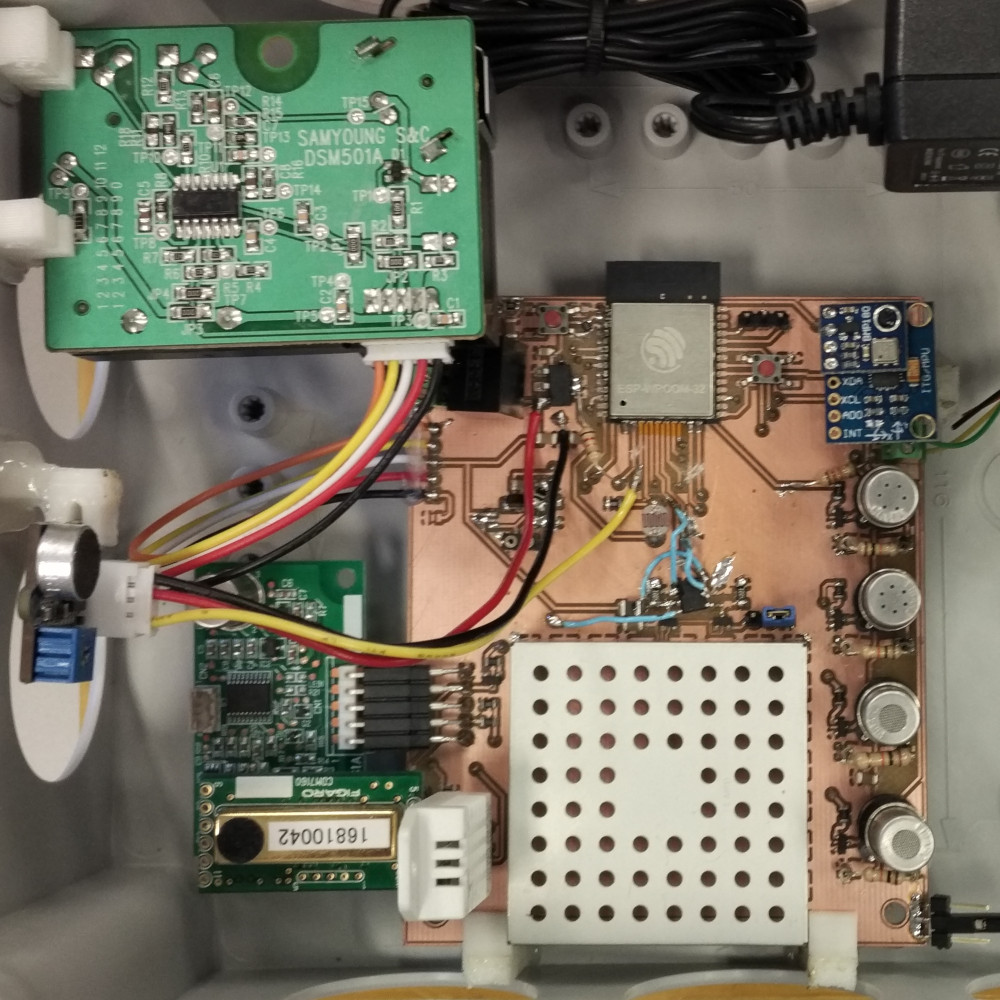
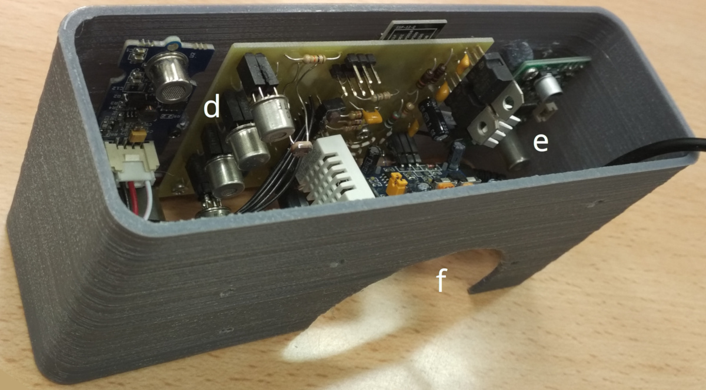
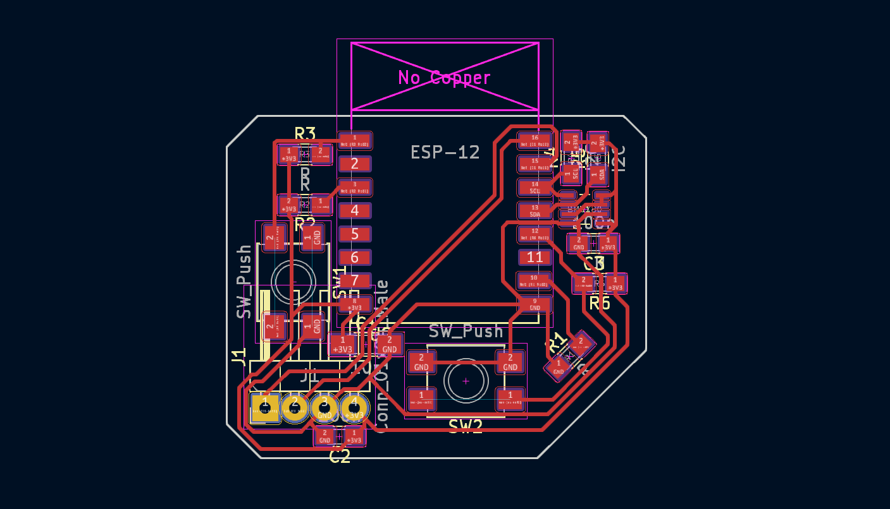
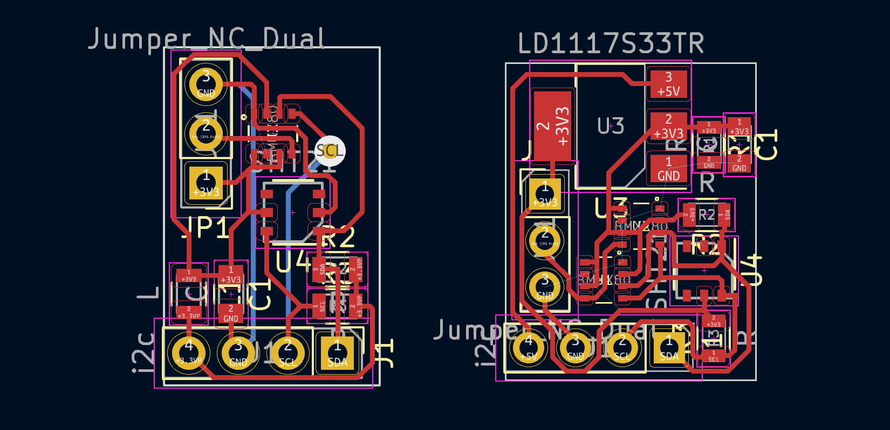

# UAMSense
Artificial nose design with multimodal sensing capabilities.

_Note: These are experimental designs. Use at your own risk._

Citation: `Exploration and characterization of environments under uncertainty using multimodal sensors, Carlos Garcia-Saura, 2023.`

UAMSense 4
==========

UAMSense 3
==========

UAMSense 2
==========

UAMSense 1
==========

UART-BME680
===========

I2C-Sensors
===========

License
=======
For source code: GPLv3 <https://www.gnu.org/licenses/gpl-3.0.en.html>

For hardware: Attribution-ShareAlike 4.0 International <https://creativecommons.org/licenses/by-sa/4.0/>

© Carlos Garcia-Saura 2023
